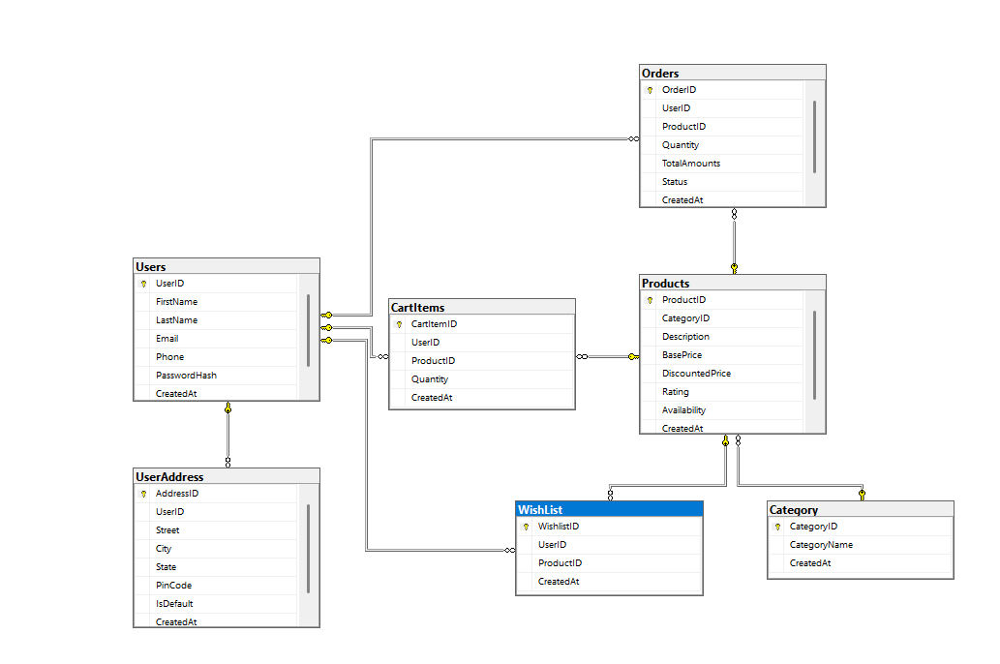

# E-Commerce Database Documentation

## Overview
This document describes the database schema for the E-Commerce Application. It includes table structures, relationships, and constraints. The ER diagram is also provided for visual reference.

---

## Entity Relationship Diagram

---

## Table Descriptions

### 1. Users
- **UserID** (int, PK): Unique identifier for each user.
- **FirstName** (nvarchar(30)): User's first name.
- **LastName** (nvarchar(30)): User's last name.
- **Email** (nvarchar(50)): User's email address.
- **Phone** (nvarchar(10)): User's phone number.
- **PasswordHash** (nvarchar(100)): Hashed password.
- **CreatedAt** (datetime): Account creation timestamp.

### 2. UserAddress
- **AddressID** (int, PK): Unique identifier for each address.
- **UserID** (int, FK): References Users(UserID).
- **Street** (nvarchar(100)): Street address.
- **City** (nvarchar(50)): City name.
- **State** (nvarchar(50)): State name.
- **PinCode** (nvarchar(6)): Postal code.
- **IsDefault** (bit, default 1): Indicates if this is the default address.
- **CreatedAt** (datetime): Address creation timestamp.

### 3. Category
- **CategoryID** (int, PK): Unique identifier for each category.
- **CategoryName** (nvarchar(30)): Name of the category.
- **CreatedAt** (datetime): Category creation timestamp.

### 4. Products
- **ProductID** (int, PK): Unique identifier for each product.
- **CategoryID** (int, FK): References Category(CategoryID).
- **Description** (nvarchar(200)): Product description.
- **BasePrice** (decimal(10,2)): Original price.
- **DiscountedPrice** (decimal(10,2)): Discounted price.
- **Rating** (decimal(1,1)): Product rating.
- **Availability** (bit, default 1): Product availability status.
- **CreatedAt** (datetime): Product creation timestamp.

### 5. CartItems
- **CartItemID** (int, PK): Unique identifier for each cart item.
- **UserID** (int, FK): References Users(UserID).
- **ProductID** (int, FK): References Products(ProductID).
- **Quantity** (int): Quantity of the product in cart.
- **CreatedAt** (datetime): Cart item creation timestamp.

### 6. Orders
- **OrderID** (int, PK): Unique identifier for each order.
- **UserID** (int, FK): References Users(UserID).
- **ProductID** (int, FK): References Products(ProductID).
- **Quantity** (int): Quantity ordered.
- **TotalAmounts** (decimal(10,2)): Total order amount.
- **Status** (nvarchar(20)): Order status.
- **CreatedAt** (datetime): Order creation timestamp.

### 7. WishList
- **WishlistID** (int, PK): Unique identifier for each wishlist entry.
- **UserID** (int, FK): References Users(UserID).
- **ProductID** (int, FK): References Products(ProductID).
- **CreatedAt** (datetime): Wishlist entry creation timestamp.

---

## Relationships
- **Users** to **UserAddress**: One-to-many (a user can have multiple addresses).
- **Users** to **CartItems**: One-to-many (a user can have multiple cart items).
- **Users** to **Orders**: One-to-many (a user can have multiple orders).
- **Users** to **WishList**: One-to-many (a user can have multiple wishlist items).
- **Category** to **Products**: One-to-many (a category can have multiple products).
- **Products** to **CartItems**, **Orders**, **WishList**: One-to-many (a product can appear in multiple cart items, orders, and wishlists).

---

## Constraints
- **Primary Keys**: Each table has a primary key on its ID column.
- **Foreign Keys**: Enforce referential integrity between tables as described above.
- **Defaults**: Availability (Products) and IsDefault (UserAddress) default to 1.

---

## SQL Script
For full table creation and constraints, see [DB_Scripts.sql](DB_Scripts.sql).

---